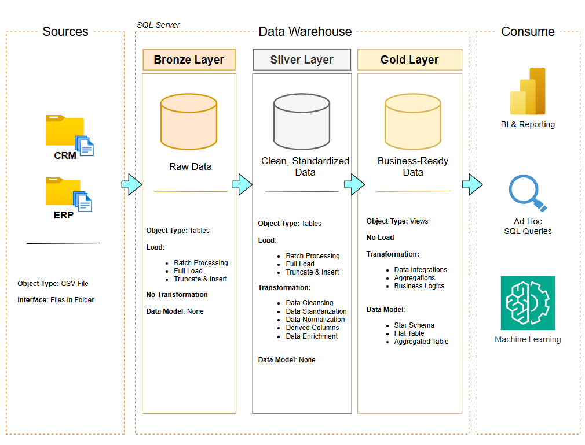
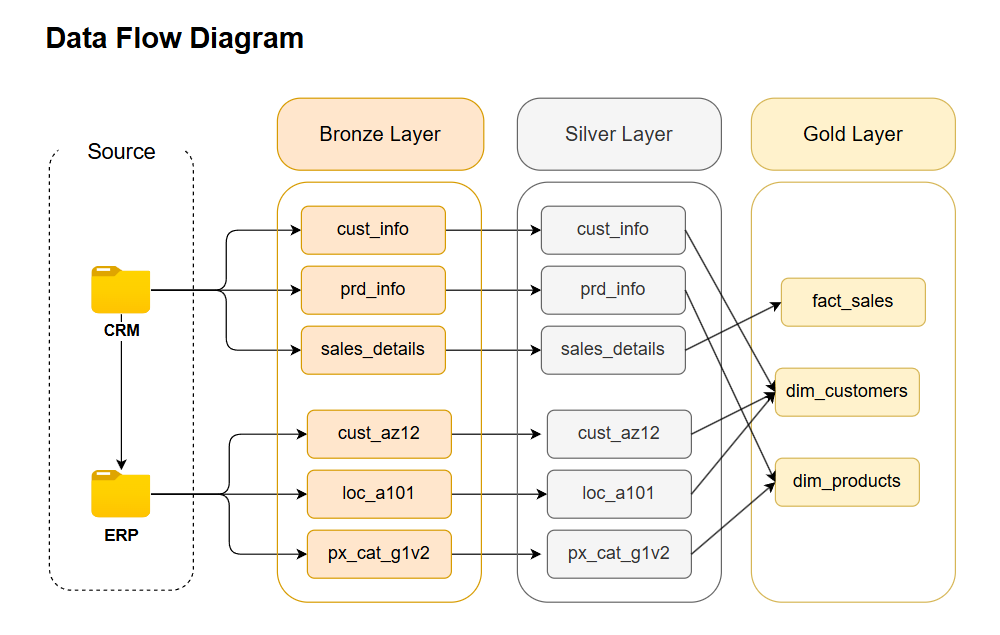
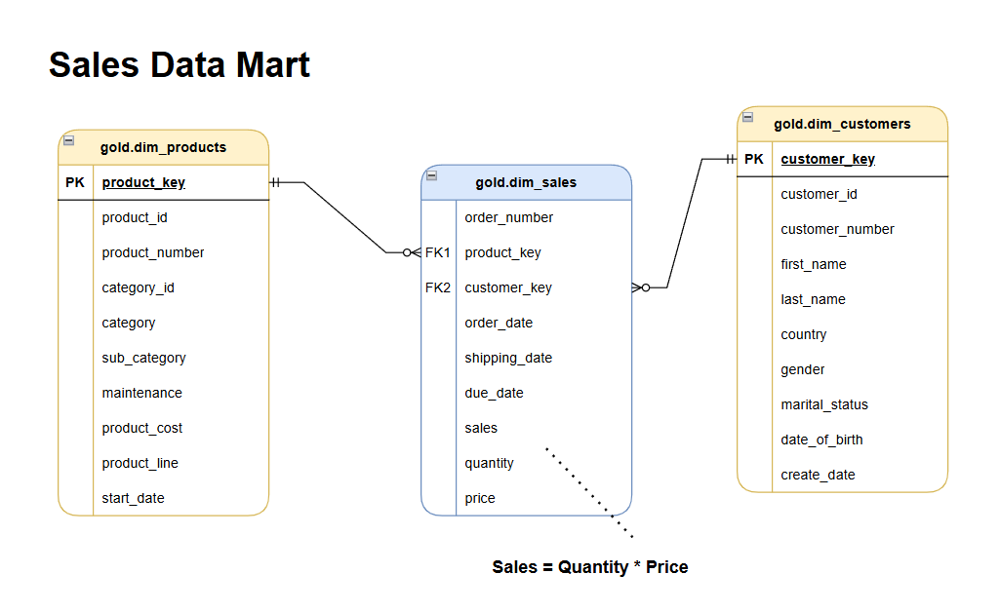

# Data Warehouse Project (SQL Server)

A fully implemented data warehouse built on Microsoft SQL Server, following the **Medallion Architecture** (Bronze, Silver, Gold). The project ingests raw CRM and ERP data from CSV files, applies transformations across layered schemas, and exposes clean, business-ready views in a Star Schema for analytics and reporting.

---

## Table of Contents

- [Project Overview](#project-overview)
- [Architecture](#architecture)
- [Repository Structure](#repository-structure)
- [Data Sources](#data-sources)
- [Layer Details](#layer-details)
  - [Bronze Layer](#bronze-layer)
  - [Silver Layer](#silver-layer)
  - [Gold Layer](#gold-layer)
- [Star Schema (Gold)](#star-schema-gold)
- [How to Run](#how-to-run)
- [Technologies Used](#technologies-used)

---

## Project Overview

This project builds a data warehouse from scratch using T-SQL on SQL Server. The warehouse consolidates data from two source systems (CRM and ERP), cleans and standardizes it through layered transformations, and delivers a Star Schema that is ready for use in BI tools and analytical queries.

The primary objectives are:

- Centralize raw data from heterogeneous sources into a single database
- Apply systematic data quality and cleansing rules at each layer
- Produce a unified customer, product, and sales model for business reporting

---

## Architecture

The warehouse follows the **Medallion Architecture**, a three-layer design pattern where data progresses from raw to refined:



| Layer  | Object Type | Load Strategy               | Transformation     | Data Model  |
|--------|-------------|-----------------------------|--------------------|-------------|
| Bronze | Tables      | Full Load / Truncate Insert | None               | None        |
| Silver | Tables      | Full Load / Truncate Insert | Cleansing, casting | None        |
| Gold   | Views       | On read                     | Joins, enrichment  | Star Schema |



---

## Repository Structure

```
sql-data-warehouse-project/
|
|-- datasets/
|   |-- source_crm/
|   |   |-- cust_info.csv
|   |   |-- prd_info.csv
|   |   |-- sales_details.csv
|   |
|   |-- source_erp/
|       |-- CUST_AZ12.csv
|       |-- LOC_A101.csv
|       |-- PX_CAT_G1V2.csv
|
|-- docs/
|
|-- scripts/
|   |-- bronze/
|   |   |-- ddl_bronze.sql         -- Create bronze tables
|   |   |-- proc_load_bronze.sql   -- Stored procedure: load bronze
|   |
|   |-- silver/
|   |   |-- ddl_silver.sql         -- Create silver tables
|   |   |-- proc_load_silver.sql   -- Stored procedure: load silver
|   |
|   |-- gold/
|       |-- ddl_gold.sql           -- Create gold views
|
|-- init_database.sql              -- Database and schema initialization
|-- LICENSE
|-- README.md
```

---

## Data Sources

The warehouse ingests data from two external source systems, each provided as CSV files.

### CRM (Customer Relationship Management)

| File               | Description                                    |
|--------------------|------------------------------------------------|
| `cust_info.csv`    | Customer demographic and profile data          |
| `prd_info.csv`     | Product catalog with cost, line, and date info |
| `sales_details.csv`| Sales transaction records                      |

### ERP (Enterprise Resource Planning)

| File             | Description                         |
|------------------|-------------------------------------|
| `CUST_AZ12.csv`  | Customer birth date and gender data |
| `LOC_A101.csv`   | Customer country/location data      |
| `PX_CAT_G1V2.csv`| Product category and subcategory    |

---

## Layer Details

### Bronze Layer

The Bronze layer is the raw landing zone. Data is loaded from CSV files using `BULK INSERT` with no transformations applied. Tables mirror the structure of the source files exactly.

**Tables:**
- `bronze.crm_cust_info`
- `bronze.crm_prd_info`
- `bronze.crm_sales_details`
- `bronze.erp_cust_az12`
- `bronze.erp_loc_a101`
- `bronze.px_cat_g1v2`

**Load procedure:** `EXEC bronze.load_bronze;`

Each table is truncated before reload. The procedure tracks and prints the load duration for each table and reports total elapsed time.

---

### Silver Layer

The Silver layer applies systematic cleansing and standardization rules to produce consistent, reliable data. Each Silver table includes a `dwh_create_date` audit column.

**Key transformations applied:**

| Table                      | Transformations                                                                 |
|----------------------------|---------------------------------------------------------------------------------|
| `silver.crm_cust_info`     | Trim whitespace; decode gender (M/F) and marital status (S/M); deduplicate by most recent record per customer |
| `silver.crm_prd_info`      | Extract category ID from product key; decode product line codes; compute product end date using `LEAD()` |
| `silver.crm_sales_details` | Validate and cast date integers (8-digit format); recalculate sales and price when inconsistent |
| `silver.erp_cust_az12`     | Strip 'NAS' prefix from customer IDs; nullify future birth dates; normalize gender values |
| `silver.erp_loc_a101`      | Remove hyphens from customer IDs; standardize country codes (e.g., DE, US, USA) |
| `silver.erp_px_cat_g1v2`   | Passed through as-is (already clean)                                            |

**Load procedure:** `EXEC silver.load_silver;`

---

### Gold Layer

The Gold layer consists of SQL views that join and enrich Silver tables into a Star Schema. These views are the consumption layer for reporting tools and analytical queries.

**Views:**
- `gold.dim_customers`
- `gold.dim_products`
- `gold.fact_sales`

---

## Star Schema (Gold)



The `fact_sales` view links to both dimension views through surrogate keys (`product_key`, `customer_key`) generated via `ROW_NUMBER()`.

---

## How to Run

Follow the steps below in order. All scripts are located in the `scripts/` folder.

**Step 1: Initialize the database**

Run `init_database.sql` to create the `DataWarehouse` database and the `bronze`, `silver`, and `gold` schemas.

> Warning: This script drops the `DataWarehouse` database if it already exists. Back up any existing data before running.

**Step 2: Create Bronze tables**

Run `scripts/bronze/ddl_bronze.sql` to create all Bronze layer tables.

**Step 3: Load Bronze layer**

Update the file paths in `scripts/bronze/proc_load_bronze.sql` to match your local dataset directory, then execute:

```sql
EXEC bronze.load_bronze;
```

**Step 4: Create Silver tables**

Run `scripts/silver/ddl_silver.sql` to create all Silver layer tables.

**Step 5: Load Silver layer**

```sql
EXEC silver.load_silver;
```

**Step 6: Create Gold views**

Run `scripts/gold/ddl_gold.sql` to create the `dim_customers`, `dim_products`, and `fact_sales` views.

**Step 7: Query the Gold layer**

The Gold views are now ready for use:

```sql
SELECT * FROM gold.dim_customers;
SELECT * FROM gold.dim_products;
SELECT * FROM gold.fact_sales;
```

---

## Technologies Used

- **Database:** Microsoft SQL Server
- **Language:** T-SQL
- **Architecture Pattern:** Medallion Architecture (Bronze / Silver / Gold)
- **Data Model:** Star Schema (Fact + Dimensions)
- **Load Strategy:** Full Load via Truncate and Insert / Bulk Insert
- **Diagramming:** draw.io
- **Version Control:** Git / GitHub
